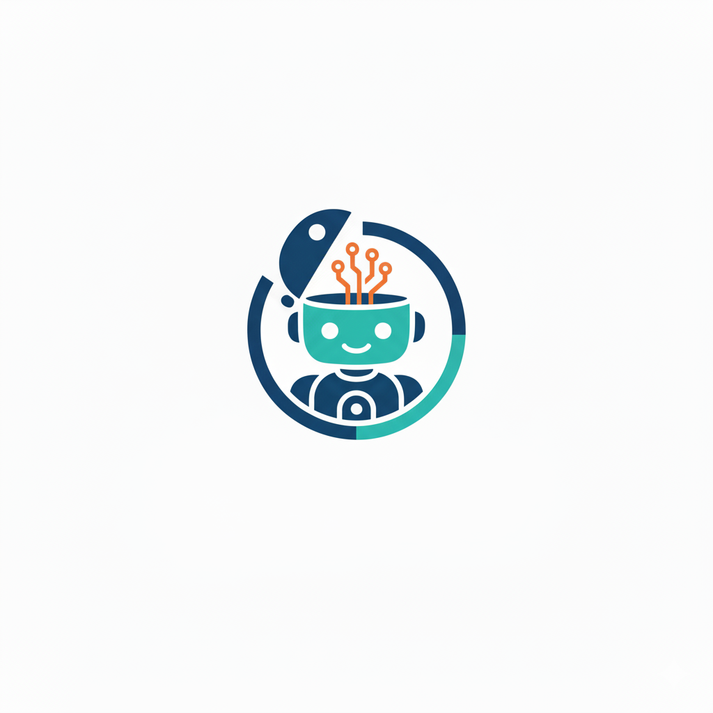

<p align="center">
  
</p>

<h1 align="center">OpenBot</h1>

<p align="center">
  <strong>Open-Source Personal AI Assistant</strong><br/>
  Go-native &bull; Multi-LLM &bull; Multi-Channel &bull; Tool-Augmented &bull; Secure
</p>

<p align="center">
  
  
  
  
</p>

---

## Overview

OpenBot is a self-hosted AI assistant written entirely in Go. It connects to multiple LLM providers, exposes three user-facing channels (CLI, Telegram, Web UI), and lets the agent interact with your system through a pluggable tool system — all while enforcing security policies on every action.

**Key design goals**: single binary deployment, zero JavaScript frameworks, persistent memory, and full control over your data.

---

## Features

### Channels (Interfaces)

| Channel | Description |
|---------|-------------|
| **CLI** | Interactive REPL with animated spinner, inline confirmation prompts |
| **Telegram Bot** | Full-featured bot with inline keyboard confirmations, Markdown rendering, rate-limit retry |
| **Web UI** | Tailwind CSS + vanilla JS dashboard with chat, settings page, session persistence, Markdown + syntax highlighting |

### LLM Providers

| Provider | Mode | Tool Calling | Notes |
|----------|------|:---:|-------|
| **Ollama** | API | Yes | Local/cloud, streaming, exponential backoff retry |
| **OpenAI** | API | Yes | GPT-4, GPT-3.5-turbo and all OpenAI models |
| **Claude** | API | Yes | Anthropic Claude models |
| **ChatGPT Web** | Browser | No | Use your ChatGPT Plus subscription via headless Chrome |
| **Gemini Web** | Browser | No | Use your Google AI Premium subscription via headless Chrome |

Multiple providers can be enabled simultaneously. Switch the default at runtime via the Settings UI or CLI.

### Tools (Agent Capabilities)

| Tool | Description |
|------|-------------|
| `shell` | Execute shell commands (with security checks) |
| `read_file` | Read file contents (workspace-sandboxed) |
| `write_file` | Write/create files (workspace-sandboxed) |
| `list_dir` | List directory contents |
| `web_search` | Search the web via DuckDuckGo |
| `web_fetch` | Fetch and extract content from any URL (SSRF-protected) |
| `system_info` | Detailed system info — CPU, RAM, GPU, Disk, OS, network |
| `screen` | Screen control — mouse, keyboard, screenshots (robotgo) |
| `cron` | Create, list, remove scheduled tasks at runtime |

### Security Engine

- **Blacklist**: Dangerous commands are always blocked (`rm -rf /`, `mkfs`, `dd if=`)
- **Whitelist**: Safe commands are always allowed (`ls`, `cat`, `git status`)
- **Confirm patterns**: Risky commands require user confirmation (`sudo`, `rm`, `kill`)
- **Default policy**: Configurable fallback — `allow`, `deny`, or `ask`
- **Audit logging**: Every tool execution is logged
- **Workspace sandbox**: File tools enforce path boundaries
- **Web UI auth**: Optional HTTP Basic Auth for the Web UI
- **Telegram confirmations**: Inline keyboard buttons for approve/deny in gateway mode

### Persistent Memory

- **SQLite-backed** conversation storage (pure Go, no CGO)
- Per-conversation message history with configurable retention
- Long-term memory entries
- Auto-generated conversation titles
- Session persistence across Web UI page reloads

### Other

- **Config validation** — schema validation on all config changes (max iterations, port, policy, timeouts)
- **Concurrent message processing** (semaphore-limited, 3 max)
- **LLM rate limiting** (token bucket)
- **HTTP connection pooling** for API providers
- **Streaming responses** support (Ollama)
- **Graceful shutdown** with signal handling and timeout
- **Session-targeted SSE** — Web UI messages routed to the correct browser session
- **JSON escape sanitization** for smaller model compatibility
- **Cross-compilation** for Linux and macOS ARM64
- **Docker support** — multi-stage Dockerfile and Docker Compose

---

## Quick Start

```bash
# Clone the repository
git clone https://github.com/your-org/openbot.git
cd openbot

# Build
make build

# Initialize config and workspace
./build/openbot init

# Edit configuration
vim ~/.openbot/config.json

# Start interactive CLI chat (requires Ollama running locally)
./build/openbot chat

# Or start the full gateway (Telegram + Web UI + Agent)
./build/openbot gateway

# Use a custom config file
./build/openbot gateway --config ./config.json
```

### Prerequisites

- **Go 1.23+**
- **[Ollama](https://ollama.com)** for local LLM (recommended to start)
- **Chrome/Chromium** (optional, only for ChatGPT Web / Gemini Web providers)
- **Node.js 18+** (optional, only for running E2E tests)
- **Docker** (optional, for containerized deployment)

---

## Commands

| Command | Description |
|---------|-------------|
| `openbot init` | Create default config (`~/.openbot/config.json`) and workspace dir |
| `openbot chat` | Start interactive CLI chat |
| `openbot gateway` | Start all enabled channels + agent loop |
| `openbot gateway -c ./config.json` | Start with a custom config file |
| `openbot login chatgpt` | Open Chrome to log in to ChatGPT (saves session cookies) |
| `openbot login gemini` | Open Chrome to log in to Gemini (saves session cookies) |
| `openbot status` | Show config path and provider health |
| `openbot config list` | Display all config values (sensitive data masked) |
| `openbot config get <path>` | Get a specific value (e.g. `general.defaultProvider`) |
| `openbot config set <path> <value>` | Update a value and save to disk |
| `openbot config path` | Show the active config file path |

All commands accept `--config` / `-c` to override the default config path.

---

## Configuration

Default path: `~/.openbot/config.json`

A full example is available in [`config.example.json`](config.example.json). Below are the key sections:

### General

```json
{
  "general": {
    "workspace": "~/.openbot/workspace",
    "logLevel": "info",
    "maxIterations": 20,
    "defaultProvider": "ollama"
  }
}
```

| Field | Type | Description | Validation |
|-------|------|-------------|------------|
| `workspace` | string | Working directory for file tools | — |
| `logLevel` | string | Log verbosity (`debug`, `info`, `warn`, `error`) | — |
| `maxIterations` | int | Max LLM-tool loop cycles per request | 1–200 |
| `defaultProvider` | string | Active LLM provider name | — |

### Providers

```json
{
  "providers": {
    "ollama": {
      "enabled": true,
      "mode": "api",
      "apiBase": "http://localhost:11434",
      "defaultModel": "llama3.1:8b"
    },
    "openai": {
      "enabled": false,
      "mode": "api",
      "apiKey": "sk-...",
      "defaultModel": "gpt-4"
    },
    "claude": {
      "enabled": false,
      "mode": "api",
      "apiKey": "sk-ant-...",
      "defaultModel": "claude-sonnet-4-20250514"
    }
  }
}
```

### Channels

```json
{
  "channels": {
    "telegram": {
      "enabled": true,
      "token": "YOUR_BOT_TOKEN",
      "allowFrom": ["YOUR_USER_ID"],
      "parseMode": "Markdown"
    },
    "web": {
      "enabled": true,
      "host": "127.0.0.1",
      "port": 8080,
      "auth": {
        "enabled": false,
        "username": "",
        "passwordHash": ""
      }
    },
    "cli": { "enabled": true }
  }
}
```

| Web Auth Field | Description |
|----------------|-------------|
| `auth.enabled` | Enable HTTP Basic Auth on all Web UI endpoints |
| `auth.username` | Basic Auth username |
| `auth.passwordHash` | Bcrypt hash of password (plain text also accepted for dev) |

### Security

```json
{
  "security": {
    "defaultPolicy": "ask",
    "workspaceSandbox": false,
    "blacklist": ["rm -rf /", "mkfs", "dd if="],
    "whitelist": ["ls", "cat", "echo", "pwd", "date", "git status"],
    "confirmPatterns": ["rm ", "sudo ", "kill ", "chmod ", "apt ", "brew "],
    "confirmTimeoutSeconds": 60,
    "auditLog": true
  }
}
```

| Field | Validation |
|-------|------------|
| `defaultPolicy` | Must be `allow`, `deny`, or `ask` |
| `confirmTimeoutSeconds` | Must be > 0 |

### Memory

```json
{
  "memory": {
    "enabled": true,
    "dbPath": "~/.openbot/memory.db",
    "maxHistoryPerConversation": 100,
    "retentionDays": 365
  }
}
```

| Field | Validation |
|-------|------------|
| `maxHistoryPerConversation` | Must be > 0 |
| `retentionDays` | Must be > 0 |

### Tools

```json
{
  "tools": {
    "shell": { "timeout": 30, "maxOutputBytes": 65536 },
    "screen": { "enabled": false },
    "web": { "searchProvider": "duckduckgo", "searchApiKey": "" }
  }
}
```

| Field | Validation |
|-------|------------|
| `shell.timeout` | Must be > 0 |

### Cron

```json
{
  "cron": { "enabled": true, "tasks": [] }
}
```

---

## Web UI

When `channels.web.enabled` is `true`, the Web UI is available at `http://127.0.0.1:8080` (configurable host/port).

| Page | Path | Description |
|------|------|-------------|
| Dashboard | `/` | System overview and status |
| Chat | `/chat` | Conversational interface with Markdown rendering and syntax highlighting |
| Settings | `/settings` | Live configuration editor — enable providers, modify settings, save to disk |

### API Endpoints

| Method | Endpoint | Description |
|--------|----------|-------------|
| GET | `/status` | Health check — returns `{ status, version, time }` |
| GET | `/api/config` | Get current config (sensitive fields masked) |
| PUT | `/api/config` | Update config — partial (`{ path, value }`) or full replacement |
| POST | `/api/config/save` | Persist current config to disk |
| POST | `/chat/send` | Send a chat message (form field: `message`) |
| POST | `/chat/clear` | Clear the current session |
| GET | `/chat/events` | SSE stream for real-time assistant responses |

The Web UI uses session cookies (`openbot_session`) to maintain conversation context across page reloads. Static assets (logo) are embedded in the binary.

---

## Architecture

```
                    ┌───────────────┐
                    │   Telegram    │
                    └───────┬───────┘
                            │
 ┌──────────┐    ┌──────────┴────────────┐    ┌───────────────┐
 │   CLI    │────│     Message Bus       │────│    Web UI     │
 └──────────┘    └──────────┬────────────┘    └───────────────┘
                            │
                     ┌──────┴───────┐
                     │  Agent Loop  │
                     │  (concurrent │
                     │   semaphore) │
                     └──────┬───────┘
                            │
            ┌───────────────┼───────────────┐
            │               │               │
     ┌──────┴──────┐  ┌────┴─────┐  ┌──────┴──────┐
     │   Provider   │  │  Tools   │  │  Security   │
     │   Factory    │  │ Registry │  │   Engine    │
     └──────┬──────┘  └────┬─────┘  └──────┬──────┘
            │               │               │
    ┌───┬───┴───┬───┐  ┌───┴───┐    ┌──────┴──────┐
    │Oll│OAI│Cld│Web│  │9 tools│    │ Blacklist   │
    └───┴───┴───┴───┘  └───────┘    │ Whitelist   │
                                    │ Confirm     │
            ┌───────────────┐       │ Audit Log   │
            │  Session Mgr  │       └─────────────┘
            │  + SQLite     │
            │  + Rate Limit │
            └───────────────┘
```

**Data flow**: Channel receives user input → publishes `InboundMessage` to Message Bus → Agent Loop subscribes, builds prompt with history, calls LLM → if tool calls returned, executes tools through Security Engine → loops until text response → publishes `OutboundMessage` → Channel delivers to user.

---

## Project Structure

```
openbot/
├── cmd/openbot/
│   └── main.go                    # CLI entry point (Cobra commands)
├── internal/
│   ├── domain/                    # Interfaces & core types
│   │   ├── provider.go            #   Provider, ChatRequest/Response, Message, ToolCall
│   │   ├── channel.go             #   Channel interface
│   │   ├── bus.go                 #   MessageBus interface
│   │   ├── memory.go              #   MemoryStore interface, Conversation, MemoryEntry
│   │   ├── message.go             #   InboundMessage, OutboundMessage
│   │   ├── security.go            #   SecurityEngine interface, SecurityAction
│   │   └── tool.go                #   Tool interface
│   ├── agent/                     # Agent engine
│   │   ├── loop.go                #   Core loop: LLM ↔ tool execution cycle
│   │   ├── loop_test.go           #   Tests: tool call extraction, JSON sanitize
│   │   ├── prompt.go              #   System prompt builder with context
│   │   ├── session.go             #   Conversation & session manager (RWMutex)
│   │   ├── session_test.go        #   Tests: title generation
│   │   ├── ratelimit.go           #   Token bucket rate limiter
│   │   └── ratelimit_test.go      #   Tests: burst, refill, cancel
│   ├── provider/                  # LLM provider implementations
│   │   ├── ollama.go              #   Ollama (streaming, retry, configurable model)
│   │   ├── openai.go              #   OpenAI API
│   │   ├── claude.go              #   Anthropic Claude API
│   │   ├── chatgpt_web.go         #   ChatGPT via headless Chrome
│   │   ├── gemini_web.go          #   Gemini via headless Chrome
│   │   ├── factory.go             #   Provider factory with health checks
│   │   └── httpclient.go          #   Shared HTTP client with connection pooling
│   ├── channel/                   # User-facing channels
│   │   ├── cli.go                 #   CLI REPL with spinner
│   │   ├── telegram.go            #   Telegram bot with confirmations & retry
│   │   ├── web.go                 #   Web UI server (auth, SSE, config API)
│   │   ├── web_templates/         #   HTML templates (dashboard, chat, settings)
│   │   └── web_assets/            #   Embedded static files (logo)
│   ├── tool/                      # Agent tools
│   │   ├── registry.go            #   Tool registry & execution
│   │   ├── registry_test.go       #   Tests: register, execute, parameters
│   │   ├── shell.go               #   Shell command execution
│   │   ├── file.go                #   Read/Write/List (workspace-sandboxed)
│   │   ├── search.go              #   Web search (DuckDuckGo) & URL fetch
│   │   ├── sysinfo.go             #   System information (CPU, RAM, GPU, Disk)
│   │   ├── screen.go              #   Screen control (robotgo)
│   │   └── cron.go                #   Scheduled task manager
│   ├── memory/
│   │   └── store.go               #   SQLite storage (pure Go, no CGO)
│   ├── security/
│   │   ├── engine.go              #   Security policy engine + audit logger
│   │   └── engine_test.go         #   Tests: blacklist, whitelist, confirm, policy
│   ├── bus/
│   │   └── bus.go                 #   In-process message bus (Go channels)
│   ├── browser/
│   │   └── bridge.go              #   Headless Chrome bridge (chromedp)
│   └── config/
│       ├── config.go              #   Config types, Load/Save, Validate
│       ├── config_test.go         #   Tests: validate, load/save, accessor, flex
│       ├── accessor.go            #   Dot-notation Get/Set, Sanitize, ListPaths
│       └── defaults.go            #   Default configuration values
├── e2e/                           # End-to-end tests (Playwright)
│   ├── package.json               #   Node.js project for E2E tests
│   ├── playwright.config.js       #   Playwright configuration
│   └── tests/
│       └── web-ui.spec.js         #   19 E2E tests for Web UI & API
├── assets/
│   └── logo.png                   # Project logo
├── config.example.json            # Example configuration template
├── Dockerfile                     # Multi-stage Docker build
├── docker-compose.yml             # Docker Compose for easy deployment
├── .dockerignore                  # Docker build context exclusions
├── Makefile                       # Build, test, lint, Docker, cross-compile targets
├── go.mod
├── go.sum
└── .gitignore
```

---

## Build & Development

```bash
# Build
make build                 # → ./build/openbot

# Run tests
make test                  # go test ./... -v -race

# Run E2E tests (requires gateway running on :8080)
make e2e

# Lint (requires golangci-lint)
make lint

# Cross-compile
make build-linux           # → ./build/openbot-linux-amd64
make build-darwin          # → ./build/openbot-darwin-arm64

# Clean
make clean

# Tidy dependencies
make tidy
```

---

## Makefile Targets

| Target | Description |
|--------|-------------|
| `make build` | Build binary to `./build/openbot` |
| `make run ARGS='...'` | Run with custom arguments |
| `make dev` | Run interactive chat (`openbot chat`) |
| `make test` | Run all Go unit tests with race detection |
| `make e2e` | Run Playwright E2E tests (requires running gateway) |
| `make clean` | Remove build artifacts and Go cache |
| `make install` | Install to `$GOPATH/bin` |
| `make tidy` | Run `go mod tidy` |
| `make lint` | Run `golangci-lint` |
| `make build-linux` | Cross-compile for Linux AMD64 |
| `make build-darwin` | Cross-compile for macOS ARM64 |
| `make init` | Initialize config and workspace |
| `make docker-build` | Build Docker image (`openbot:VERSION`) |
| `make docker-run` | Run container with local config mounted |
| `make docker-compose` | Start with Docker Compose (detached) |

---

## Testing

### Go Unit Tests (74 tests)

```bash
make test
```

| Package | Tests | Coverage |
|---------|-------|----------|
| `internal/agent` | 27 | loop, ratelimit, session |
| `internal/config` | 25 | validate, load/save, accessor |
| `internal/security` | 16 | blacklist, whitelist, confirm, policy |
| `internal/tool` | 13 | registry, parameters, args |

All tests run with the **race detector** enabled.

### Playwright E2E Tests (19 tests)

```bash
# Start gateway first
./build/openbot gateway --config ./config.json &

# Run E2E tests
make e2e
```

E2E tests cover:
- Dashboard, Chat, Settings page loading
- `/status` and `/api/config` API responses
- Config sanitization (secrets masked)
- Static asset accessibility and caching
- Page navigation
- Empty message validation
- Session management (cookies, clear)

**Requirements**: Node.js 18+, Chromium (auto-installed by Playwright).

---

## Docker

### Build and Run

```bash
# Build image
make docker-build

# Run container (mount your config)
make docker-run

# Or use Docker Compose
make docker-compose
```

### Manual Docker Commands

```bash
# Build
docker build -t openbot:0.1.0 .

# Run
docker run --rm \
  -p 8080:8080 \
  -v $(pwd)/config.json:/home/openbot/.openbot/config.json:ro \
  openbot:0.1.0

# Docker Compose
docker compose up -d
```

### Docker Details

| Property | Value |
|----------|-------|
| Build base | `golang:1.23-alpine` (multi-stage) |
| Runtime base | `alpine:3.20` |
| Binary | Statically linked (CGO_ENABLED=0) |
| User | Non-root `openbot` |
| Health check | `GET /status` every 30s |
| Port | `8080` (Web UI) |
| Config mount | `/home/openbot/.openbot/config.json` |
| Data volume | `/home/openbot/.openbot` (workspace + SQLite DB) |

---

## How It Works

1. **User sends a message** through any channel (CLI, Telegram, or Web UI)
2. The channel publishes an `InboundMessage` to the **Message Bus**
3. The **Agent Loop** picks up the message with concurrency control (semaphore)
4. It loads **conversation history** from SQLite and builds the full prompt
5. The prompt is sent to the configured **LLM Provider** (with rate limiting)
6. If the LLM returns **tool calls**, each is checked against the **Security Engine**
7. Approved tools are **executed** and results fed back to the LLM
8. Steps 5-7 repeat until the LLM returns a text response (max iterations enforced)
9. The response is published as an `OutboundMessage` and delivered to the user
10. Conversation is **saved to SQLite** for future context

---

## Environment Variables

| Variable | Used By | Description |
|----------|---------|-------------|
| `TZ` | Docker | Timezone (e.g. `Asia/Ho_Chi_Minh`) |
| `VERSION` | Makefile | Override build version (default: `0.1.0`) |

---

## Troubleshooting

| Issue | Solution |
|-------|----------|
| `connection refused` on Ollama | Ensure Ollama is running: `ollama serve` |
| Web UI not loading | Check `channels.web.enabled: true` and correct host/port |
| Telegram bot not responding | Verify `token` and `allowFrom` in config |
| ChatGPT/Gemini web not working | Run `openbot login chatgpt` first to authenticate |
| Docker healthcheck failing | Ensure `channels.web.enabled: true` with port 8080 in config |
| Config validation error | Check field constraints (maxIterations: 1-200, port: 1-65535) |

---

## License

MIT
